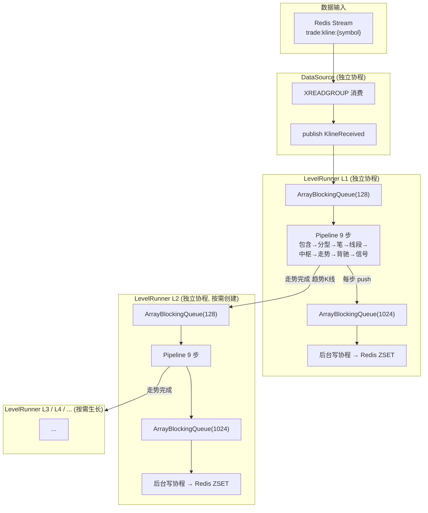
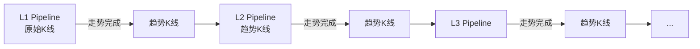

# 缠论实时分析系统 · Chan Theory Live Analyzer

基于缠中说禅理论的实时市场结构分析系统。流式架构，多级别递归，数据驱动级别生长。

## 架构概览



## 数据流

| 模块 | 职责 | 并发模型 |
|------|------|---------|
| DataSource | Redis Stream 消费（XREADGROUP） | 独立协程 |
| LevelRunner L1 | 原始 K 线 → 缠论分析 | 独立协程 |
| LevelRunner L2+ | 趋势 K 线 → 高级别分析 | 按需创建，各独立协程 |
| OutputPipe | 结果缓冲 → Redis 写入 | 每级别一个后台写协程 |

## 管道处理步骤

| Step | 处理器 | 输出 Redis Key | 说明 |
|------|--------|---------------|------|
| 1 | 包含处理 | `chan_kline` | K 线包含关系合并 |
| 2 | 分型识别 | `fractal` | 顶底分型检测 |
| 3 | 笔识别 | `stroke` | 相邻分型连接成笔 |
| 4 | 线段划分 | `segment` | 特征序列线段划分 |
| 5 | 中枢识别 | `pivot_zone` | 笔中枢/线段中枢 |
| 6 | 走势类型 | `trend_pattern` | 盘整/趋势分类 |
| 7 | 背驰判定 | `divergence` | MACD 面积法背驰 |
| 8 | 走势结束 | — | 标记走势完成状态 |
| 9 | 买卖点 | `signal` | 三类买卖点识别 |

## Redis 数据结构

Key 格式：`trade:{SYMBOL}:L{depth}:{entityType}`

```
trade:BTCUSDT:L1:chan_kline      high,low
trade:BTCUSDT:L1:fractal         type,high,low,index
trade:BTCUSDT:L1:stroke          dir,startIdx,endIdx,startP,endP,high,low
trade:BTCUSDT:L1:segment         dir,startIdx,endIdx
trade:BTCUSDT:L1:pivot_zone      zg,zd,startIdx,endIdx,dir,completed
trade:BTCUSDT:L1:trend_pattern   dir,completed,zonesCount
trade:BTCUSDT:L1:divergence      type,ratio,confirmed
trade:BTCUSDT:L1:signal          type,price,strength
```

L2、L3、L4 同一套 key 结构，depth 递增。

## 级别递归

走势完成时自动创建下一级别：



级别不预设上限，数据驱动自然生长。

## 内存管理

所有处理器使用 `RingBuffer` 固定容量窗口，自动淘汰最旧数据：

| 处理器 | 窗口容量 | 说明 |
|--------|---------|------|
| ContainProcessor | 3 | 最后 3 根合并 K 线 |
| FractalProcessor | 1000 | 最近分型索引 |
| StrokeProcessor | 1 | 最后一根确认笔 |
| SegmentProcessor (strokes) | 200 | 当前窗口内笔 |
| SegmentProcessor (segments) | 1 | 最后一段 |
| PivotZoneProcessor (zones) | 50 | 最近中枢 |
| PivotZoneProcessor (buffer) | 100/50 | 笔/线段缓冲区 |
| TrendPatternProcessor | 1 | 最后一个走势 |
| DivergenceProcessor | 1 | 最后一个背驰 |
| MACD 缓冲区 | 200 | 收盘价序列 |

## 依赖

- CangJie 1.1.3
- Redis (用于 Stream 输入和 ZSET 输出)
- redis-cj (CangJie Redis 客户端)

## 运行

```bash
# 编译
cjpm build

# 运行（需要 Redis）
./target/release/trade

# 灌测试数据
./scripts/feed_test_data.sh
```

## 配置

配置文件 `src/conf/config.cj` 中的 `defaultConfig()`：

| 参数 | 默认值 | 说明 |
|------|--------|------|
| redisAddr | 127.0.0.1 | Redis 地址 |
| redisPort | 6379 | Redis 端口 |
| streamPrefix | trade:kline | Redis Stream key 前缀 |
| consumerGroup | chan-cj-group | 消费组名 |
| symbols | BTCUSDT, ETHUSDT | 监控交易对 |
